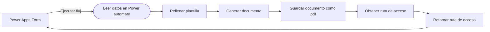

# Guía de Power Platform
## Power Apps
1. [Curso de Power Apps (Udemy)](https://www.udemy.com/course/mspowerapps-yna)
2. [Funciones y operaciones delegables](https://learn.microsoft.com/en-us/power-apps/maker/canvas-apps/delegation-overview)
3. [Tablas](https://learn.microsoft.com/en-us/power-apps/maker/canvas-apps/working-with-tables)
4. [Registros y busquedas polimórficas](https://learn.microsoft.com/en-us/power-apps/maker/canvas-apps/working-with-references)
5. [Soluciones de Power Platform](https://www.youtube.com/watch?v=RbmNhC1SYfo)

## Power Automate 
1. [Capacitaciones de Power Automate](https://drive.google.com/drive/folders/1bThPajEkSkjRmorzGy_ho6ygS7fyahto?usp=sharing) 
2. [Flujos de nube](https://learn.microsoft.com/en-us/power-automate/overview-cloud)
3. [Documentación oficial](https://learn.microsoft.com/es-es/power-automate) 

# Retos
### Power Apps 
Crear un formulario de inicio de sesión en Power Apps. 
> Los datos de los usuarios deben ser leídos desde una lista de SharePoint Online.

Una vez iniciada la sesión, mostrar otro formulario en una nueva pantalla en el que se soliciten los siguientes datos: 
- Logo (Imagen) 
- Nombre del Empleado (Input) 
- Cédula (Input) 
- Nombre de la empresa (Input) 
- Fecha actual (Datepicker) 
- Cargo (Dropdown) 
- Tipo de contrato (Dropdown) 
- Salario (Input) 

> Enviar un correo electronico con esos datos a hugo.gonzalez@sinova.co una vez el usuario presione el botón enviar 

### Power Automate 
####  Reto 1 
Generar un formulario en Microsoft Forms para el préstamo de equipos (Computadores, Monitores, Televisores, Tablets, etc). Capturar los datos de cada nueva solicitud con Power Automate y luego almacenar los datos en una lista de SharePoint Online. 
> Notificar a hugo.gonzalez@sinova.co sobre esta nueva solicitud.

### Reto de Integración 
1. De acuerdo con el [siguiente certificado](https://certificado-colombia.co/wp-content/uploads/2020/12/Certificado-Laboral-en-Colombia.jpg), crear un documento plantilla de Microsoft Word con los siguientes campos dinámicos: 
- Logo
- Nombre del Empleado 
- Cédula
- Nombre de la empresa
- Fecha actual
- Cargo
- Tipo de contrato
- Salario  
> [Guía de como crear una plantilla en Word](https://www.youtube.com/watch?v=EARRSNojNnc)
2. Cargar el documento en OneDrive.
3. Crear un flujo de nube automatizado en Power Automate que tenga como activador el conector de Power Apps. 
4. Con el trigger de Power apps recibir los campos que quedaron dinámicos en la plantilla.
5. Rellenar el documento de Word con los campos recibidos.
6. Asignar el flujo a un formulario creado en el reto de Power Apps.
7. Generar un documento en PDF resultante de la populación del certificado.
8. Mostrar el PDF resultante en Power Apps.

## Diagrama de ejemplo
Se plantea el siguiente flujo

## Soporte
- [Canal especialista en Power Apps](https://www.youtube.com/c/ShaneYoungCloud)
- [Canal especialista en Power Automate](https://www.youtube.com/c/RezaDorrani/videos)
- [Foro de Power Automate](https://powerusers.microsoft.com/t5/General-Power-Automate/bd-p/MPAForum)
- [Consultas ODATA](https://diyd365.com/2019/11/20/every-power-automate-ms-flow-filter-query-you-ever-wanted-to-know-as-a-functional-consultant/)
